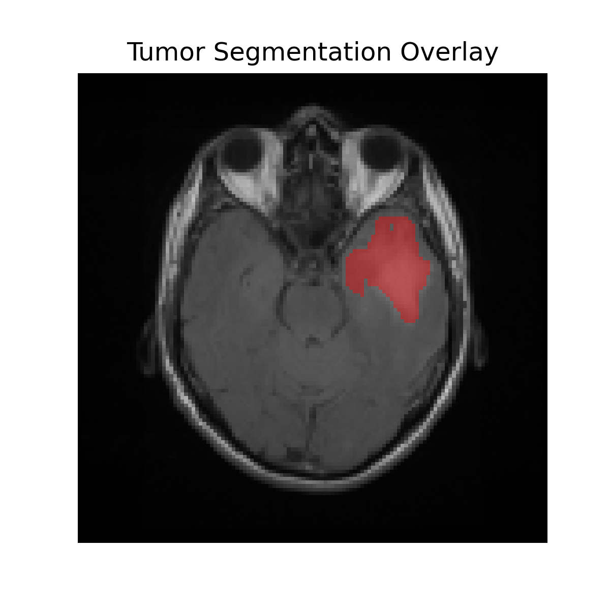
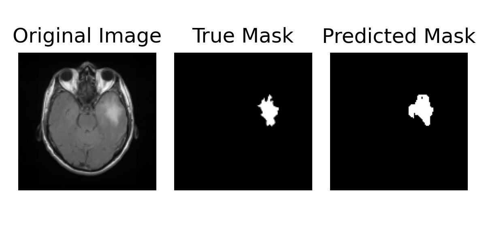
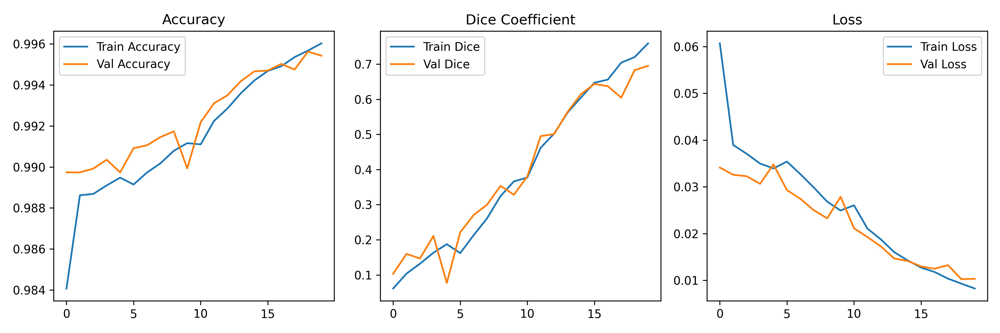

# Brain MRI Tumor Segmentation using U-Net
Deep learning-based semantic segmentation of brain MRI scans using a U-Net architecture for tumor region detection.
## Project Overview

This project implements a U-Net based deep learning pipeline for brain MRI tumor segmentation using semantic segmentation techniques. The model was trained to identify tumor regions from grayscale MRI scans and generate segmentation masks highlighting abnormal tissue regions.

## Sample Segmentation Results

### Tumor Overlay Visualization

### Prediction Example

### Training Metrics

## Dataset

Dataset used:

* LGG MRI Segmentation Dataset from Kaggle
* Dataset source: https://www.kaggle.com/datasets/mateuszbuda/lgg-mri-segmentation

The dataset contains:

* Brain MRI images
* Corresponding tumor mask annotations

## Methodology

The project pipeline includes:

* MRI image preprocessing
* Grayscale conversion
* Image resizing to 128x128
* Normalization
* Train-test split
* U-Net model implementation
* Model training and evaluation
* Tumor mask prediction
* Overlay visualization for segmentation output analysis

## Model Architecture

The segmentation model is based on the U-Net architecture with:

* Encoder-decoder structure
* Skip connections
* Convolutional layers
* Max pooling layers
* Upsampling layers

## Evaluation Metrics

The following metrics were used:

* Accuracy
* Dice Coefficient
* Intersection over Union (IoU)

Note:
Pixel-wise accuracy can be misleading in segmentation tasks because most MRI pixels belong to the background class. Dice coefficient and IoU provide a more meaningful evaluation of segmentation overlap quality.

## Sample Outputs

The repository includes:

* Training metric visualizations
* Predicted segmentation masks
* Tumor overlay visualizations

## Final Results

| Metric | Score |
|---|---|
| Test Accuracy | 99.30% |
| Dice Coefficient | 0.5597 |
| IoU Score | 0.3921 |
| Test Loss | 0.0170 |

## Technologies Used

* Python
* TensorFlow / Keras
* OpenCV
* NumPy
* Matplotlib
* Scikit-learn

## Key Skills Demonstrated

* Medical image segmentation
* Deep learning for computer vision
* Semantic segmentation using U-Net
* MRI image preprocessing
* Model evaluation using Dice and IoU metrics
* TensorFlow model training and evaluation
  
## How to Run

1. Install dependencies from requirements.txt
2. Download the dataset
3. Update dataset path
4. Run the notebook

## Limitations

The model performs reasonably on visible tumor regions but still produces some false positives and under-segmented predictions. Additional improvements such as data augmentation, Dice loss optimization, and deeper architectures may improve segmentation quality.

## Future Improvements

Potential improvements include:

* Data augmentation
* Dice loss optimization
* Improved U-Net architecture
* Post-processing techniques
* Better handling of class imbalance
