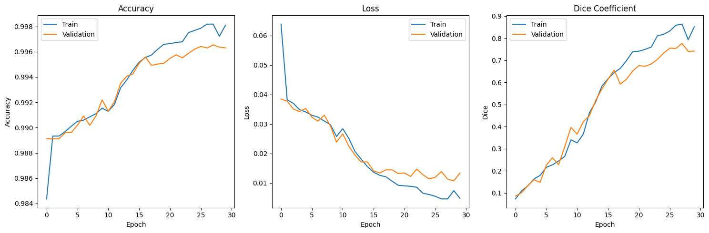
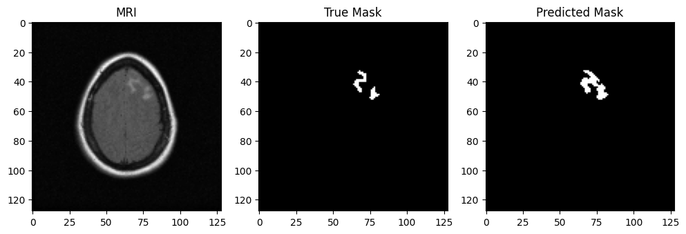
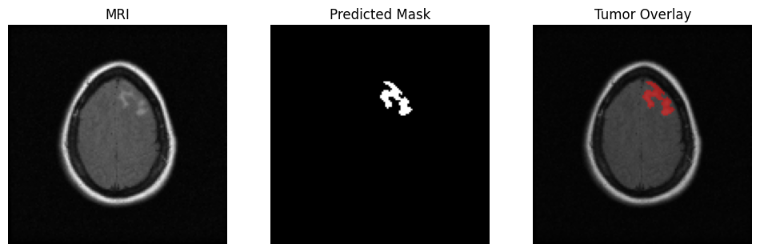

# Brain Tumor Segmentation — U-Net on Brain MRI

A model that looks at a brain MRI slice and marks out exactly which pixels belong to a tumor.

**Result: Dice score of 0.75 on scans the model never trained on.**

## What is image segmentation?

Classification answers one question: "does this image contain a tumor?" Segmentation asks a harder one: "which pixels are the tumor?"

The output isn't a label — it's a mask. A black-and-white image, same size as the input, where white pixels mean "tumor" and black pixels mean "not tumor." Instead of a yes/no answer, the model hands back an outline.

## Why this matters

Radiologists trace tumor boundaries by hand, slice by slice, on scans that can run into dozens of slices per patient. It's careful work, and it's slow — and because it's manual, two radiologists tracing the same scan won't draw identical lines.

A model that draws a first-pass outline doesn't replace that judgment. It gives the radiologist a starting boundary to correct rather than a blank slice to trace from scratch, and it can flag roughly where to look and how the outline changes across a scan.

## The dataset

[LGG MRI Segmentation](https://www.kaggle.com/datasets/mateuszbuda/lgg-mri-segmentation) — real patient brain MRI scans, each with a hand-drawn mask marking the true tumor boundary. 3,929 image/mask pairs in total, pulled directly from Kaggle.

Each mask is the ground truth: the model's job is to make its guess match it, slice after slice, until the overlap is as close as possible.

## How U-Net works

U-Net gets its name from its shape — down, then back up, like the letter U.

**Down (the encoder):** the image gets compressed in stages. Convolutions extract features (edges, textures, tissue patterns), and each pooling step shrinks the resolution while widening what the network "sees" at once.

**Up (the decoder):** that compressed understanding gets expanded back to the original resolution, so the network can commit to a per-pixel decision — tumor or not.

**Skip connections:** the detail lost while going down is passed straight across to the matching point going up, instead of being reconstructed from scratch. That's what lets the output be a sharp outline instead of a rough blob, and it's why U-Net is the standard architecture for this kind of work.

This version is a compact U-Net — two downsampling steps and two upsampling steps, with 64 → 128 → 256 filters at the encoder stages — built layer by layer rather than as a pre-packaged block, to keep every shape transformation visible and deliberate.

## The imbalance problem — and why accuracy can't see it

Tumor pixels are a small minority in this dataset. Most of any given slice is background, skull, and healthy tissue, and a large share of the slices have no tumor in them at all.

The training run makes this visible without needing a synthetic example: **accuracy barely moved.** At epoch 1, training accuracy was already 98.4%. By epoch 30, it had crept up to 99.8% — a 1.4-point improvement over the entire run. If accuracy were the only number on screen, this would look like a model that was already excellent on day one and barely improved.

Dice tells the real story. It started at 0.073 and climbed to 0.85 over the same 30 epochs — the model going from finding almost none of the tumor to finding most of it. Accuracy stayed flat because predicting "background" is right ~98% of the time by default; Dice only rewards actual overlap with the tumor, so it can't be fooled the same way.

This is the core reason every result below is reported in Dice, not accuracy.

## Results

**Training curves**

Training and validation Dice climb together across all 30 epochs — training Dice reaches 0.85, validation Dice reaches 0.74 by the final epoch, tracking each other closely rather than diverging. That's the sign the model is learning transferable patterns rather than memorizing training slices. Loss falls in step, from around 0.06 down to under 0.01.

**Predicted masks**

Three panels, on scans held out from training:

- Left — the raw MRI slice
- Middle — the radiologist's hand-drawn mask
- Right — the model's predicted mask

The model locates the tumor in roughly the right place with roughly the right shape. The edges are softer than the hand-drawn ground truth — consistent with a Dice of 0.75, which rewards strong overlap without demanding pixel-perfect boundaries.

**Tumor overlay**

The predicted mask rendered in red directly on top of the MRI slice — closer to how a radiologist would actually want to review it, in context on the scan rather than as a separate black-and-white panel.

### Setup

| Component | Choice |
|---|---|
| Model | Custom U-Net (2,066,497 parameters) |
| Input | 128×128 grayscale MRI slices (resized from 256×256) |
| Output | Binary tumor mask |
| Loss | Binary cross-entropy |
| Optimizer | Adam (default learning rate) |
| Training | 30 epochs, batch size 16, full dataset (3,143 train / 786 test, 90/10 train/val split) |
| Framework | TensorFlow / Keras |

### Results summary

| Metric | Score |
|---|---|
| Test Dice | 0.7541 |
| Train Dice (final epoch) | 0.8527 |
| Validation Dice (final epoch) | 0.7419 |
| Test accuracy | 0.9963 (not meaningful on its own — see above) |

## How to run

1. Open the notebook in Google Colab
2. Switch to a GPU runtime: Runtime → Change runtime type → T4 GPU
3. Add a Kaggle API token when prompted (Kaggle → Settings → API → Create New Token)
4. Run the cells in order

Training takes a few minutes on a T4 GPU (roughly 30s per epoch after the first).

## Tech stack

Python · TensorFlow/Keras · OpenCV · NumPy · scikit-learn · Matplotlib

## Limitations

- Trained on plain binary cross-entropy, not a Dice-aware loss — the imbalance was never corrected in the loss function itself, which is likely why Dice climbs slowly for the first ~10 epochs before accelerating. A combined BCE + Dice loss would probably converge faster and higher.
- Trained on the full dataset rather than filtering to tumor-only slices, so the model had to learn "no tumor here" and "here's the tumor" at the same time — a harder task than training on tumor slices alone, but one that means the model isn't blind to negative cases.
- Grayscale input only; the source scans carry more channels that aren't being used.
- 0.75 Dice is a solid baseline, not clinical-grade — predicted edges are rougher than an expert's hand-drawn boundary.
- Single dataset, single source — no evidence yet that this generalizes to scans from a different machine or hospital.
- A shallow, 2-level U-Net was used for clarity while building it layer by layer; a deeper 4-level U-Net (the more typical depth for this task) would likely push Dice higher.
